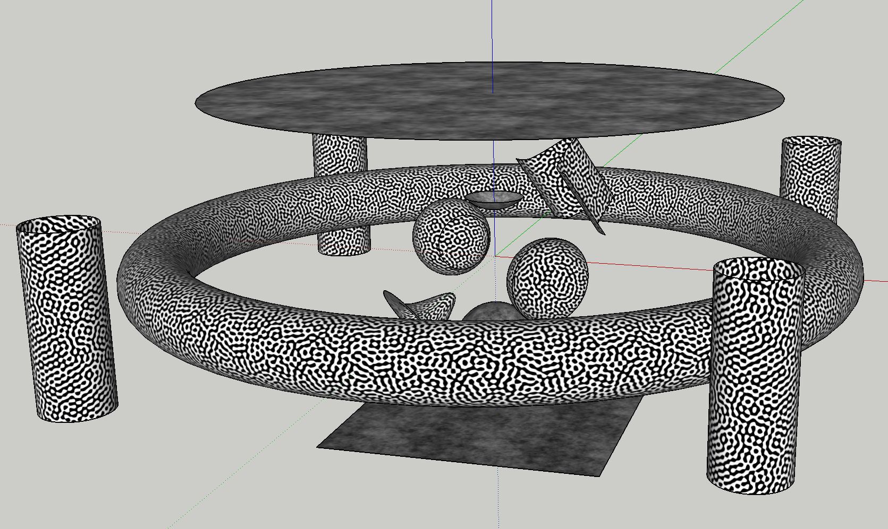
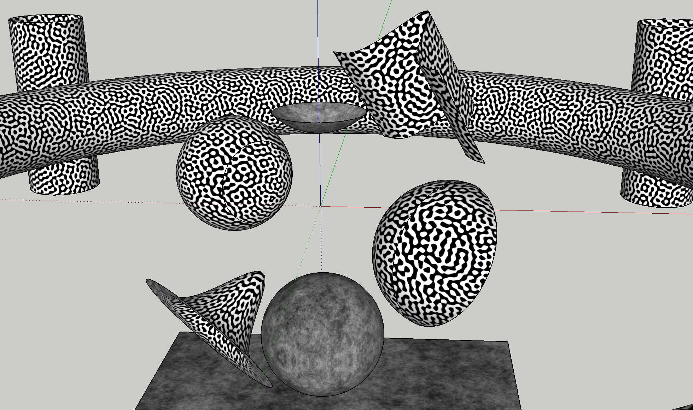

# Animation Generator ReadMe
This tool aims at generating animation of 3D geometries (more specifically, surfaces) in SketchUp. It works as a plugin of SketchUp to overcome problems caused by different OS and file systems.

To use this plugin, just put file **su_animgen.rb** and folder **su_animgen** under plugin folder of SketchUp in your system. Restart your SketchUp. Open Ruby console under menu ‘Window’. Then type in following codes line by line:

    include AnimationGenerator
    marr = ModelConfig::load(‘testmodel-git.xml’)

After this, the configuration of a model containing multiple surfaces is loaded in the list`marr`, which is short for ‘model array’. `marr[0].draw` would let SketchUp draw the model (may need to wait for couple minutes). Your can also specify surfaces you want to check by command `marr[0].surflist[#].draw`, in which, `#` is the serials number of surface (0 to 10, in this case). 

After rendered all the surfaces in the model (no matter one by one or all at once), SketchUp should show a view identical to following figures. (You may need scale up your view to see surfaces in same cases)

For animating the model, you may need to specify an output folder in your system. It is set to ‘~/Documents/SketchUp/AnimationGenerator’ by default. Then, command `marr[0].animate` should produce animation frames as image sequence under output folder your specified before. **However, I have not tested this script under Windows yet. If you encounter any problem please contact me by [email](mailto:hzhu@case.edu)**.

---

Folder **confgen** contains a MATLAB script file, which helps to generate configuration file (xml file as 'testmodel-git.xml' shown above) with random surfaces.